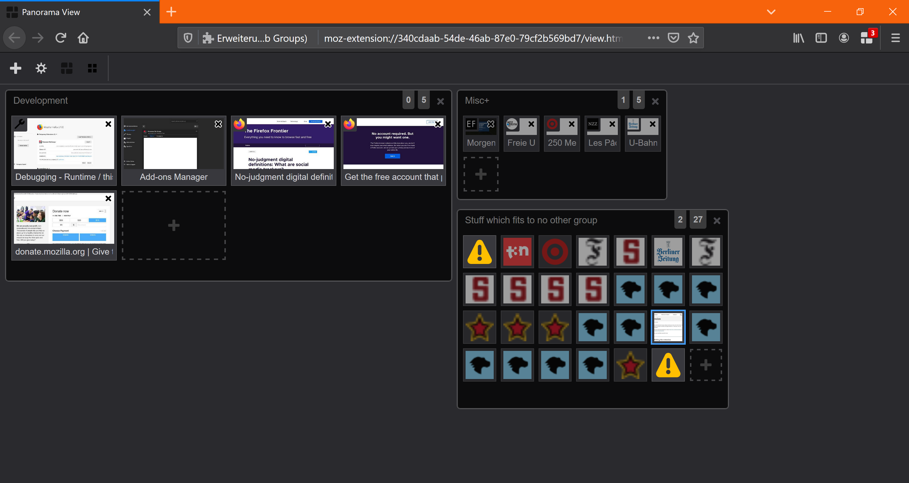
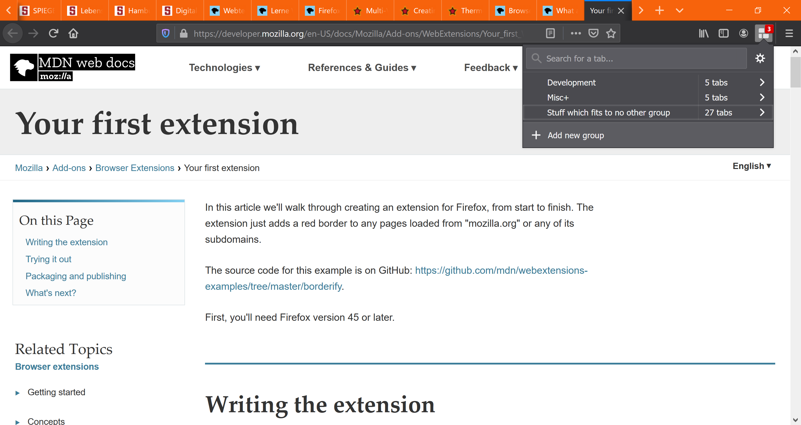

# Panorama Tab Groups

Effective Immediately: Feature Code Freeze while CI pipeline implemented to add linting and tests to clean code. Breaking changes potentially incoming

## Description

Panorama Tab Groups is an easy way to organize a lot of tabs. You can visually group related tabs and switch between groups.

Currently two different views on the groups are provided:
* freeform (classic) view

* popup view

Panorama Tab Groups is an updated and maintained fork of [Panorama View](https://github.com/photodiode/panorama-view) which is an implementation of the old [Panorama/Tab Groups add-on](https://addons.mozilla.org/en-US/firefox/addon/tab-groups-panorama/) which was deprecated with the new Firefox web extension system.

## Installation

Panorama Tab Groups is available as a Firefox Add-on [here](https://addons.mozilla.org/en-US/firefox/addon/panorama-tab-groups/). Just follow the link, click "Add to Firefox", and you're good to go.

## Usage

The default shortcut to switch to panorama view is Ctrl+Shift+F and you can to the next or previous tab group with Alt+W/Alt+Shift+W. Any of these shortcuts can be changed in the add-on preferences tab.

## Contribution

Contributions of all kind are welcome. For example:

- Bug reports and fixes
- Feature requests and solutions
- Translations corrections and additions

For more details look into the [contribution instructions](CONTRIBUTION.md).
